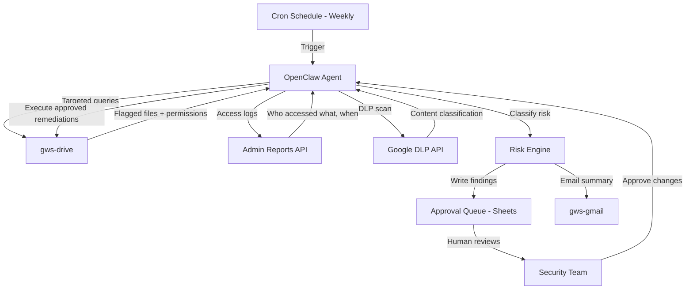

## What This System Solves

Google Drive sharing permissions are a slow-motion security incident. Someone shares a folder with a contractor, the contractor leaves, and the link stays live for two years. A sales rep shares a pricing sheet with a prospect using "anyone with the link" because it was faster than adding their email. An engineer shares an internal architecture doc with a personal Gmail account to read on the weekend and never revokes it.

None of these are malicious. All of them are risk. And nobody audits them because manually clicking through Drive sharing settings across hundreds of files is mind-numbing work that no one has time for.

This system creates a **scheduled security auditor** that uses targeted Drive API queries and Admin SDK audit logs to identify files and folders shared outside your domain, classifies the risk level of each share, and delivers a structured report — either as a weekly email digest or a living spreadsheet your security team can act on. When remediation is needed, proposed permission changes are written to an approval queue that a human reviews before anything is modified. It's the audit that should be running every week but isn't because no human wants to do it.

**A note on architecture:** This blueprint uses **OpenClaw** as the agent orchestrator, running on a schedule via cron. OpenClaw supports multiple LLM backends — you'll configure it with your Anthropic API key so Claude powers the reasoning, but the runtime, scheduling, and tool execution are all OpenClaw. If you're working interactively and want to iterate on the audit prompt or test individual `gws` commands, you can do that in **Claude Code** directly from your terminal, but Claude Code isn't the production scheduler here. OpenClaw is.

## Architecture



<StepCard number={1} label="Prerequisites" heading="Install gws and configure scoped access">

You need the `gws` CLI installed and authenticated with an account that has read access to Drive files and the Admin Reports API for audit logs. If you're a Workspace admin, your account already has this. If not, you'll need delegated admin credentials.

**Critical: scope the agent's permissions tightly.** This agent needs broad *read* access but should have *zero write access* to Drive permissions during normal scanning. Write access is only needed for the remediation phase, and that should be gated behind the human approval step. Create a dedicated service account with read-only Drive and Admin SDK scopes for scanning, and a separate credential set with write scope that's only invoked after human approval. If the agent's read-only credentials are compromised or the agent hallucinates, it can't modify anything.

```bash
# Install the CLI
npm install -g @googleworkspace/cli

# Set up auth with your admin account
gws auth setup

# Login — use a dedicated audit service account, not your personal admin
gws auth login
```

Test your access by running `gws drive files list --params '{"pageSize": 5}'` and `gws admin activities list --params '{"userKey": "all", "applicationName": "drive", "maxResults": 3}'`. If both return data, you're set. Then link the skills:

```bash
# Clone the repo and link the relevant skills
git clone https://github.com/googleworkspace/cli.git
ln -s $(pwd)/cli/skills/gws-drive ~/.openclaw/skills/
ln -s $(pwd)/cli/skills/gws-admin ~/.openclaw/skills/
ln -s $(pwd)/cli/skills/gws-gmail ~/.openclaw/skills/
ln -s $(pwd)/cli/skills/gws-sheets ~/.openclaw/skills/
ln -s $(pwd)/cli/skills/gws-shared ~/.openclaw/skills/
```

**Credential hygiene:** Rotate the agent's OAuth tokens on a regular schedule. Store credentials outside the agent's working directory — use environment variables or a secrets manager, not a config file the agent can read and potentially leak in its output. Monitor the service account's activity in the Admin console for any unexpected API calls. The agent running your security audit is itself a high-value target — treat it accordingly.

</StepCard>

<StepCard number={2} label="The workflow" heading="Build the audit and classification pipeline">

Create an `audit.md` prompt file that walks the agent through a four-phase scan. Each phase builds on the last, so ordering matters.

**Phase 1 — Targeted discovery.** Don't crawl every file and filter afterward — use the Drive API's query capabilities to go directly to the problem. The API supports visibility filters that surface the most dangerous shares without scanning your entire Drive:

```bash
# Find all "anyone with the link" shares — the highest-risk category
gws drive files list --params '{
  "q": "visibility = '\''anyoneWithLink'\'' or visibility = '\''anyoneCanFind'\''",
  "pageSize": 100,
  "fields": "nextPageToken,files(id,name,mimeType,owners,permissions(emailAddress,role,type,domain,expirationTime),sharingUser,createdTime,modifiedTime,webViewLink)",
  "includeItemsFromAllDrives": true,
  "supportsAllDrives": true
}'
```

This single query gets you every publicly linkable file in scope without touching the thousands of properly shared internal files. For user-level external shares (specific external email addresses with access), use the Admin SDK's Reports API to query Drive activity and audit logs — this is far more efficient than crawling permissions file by file:

```bash
# Query external sharing events from the audit log
gws admin activities list --params '{
  "userKey": "all",
  "applicationName": "drive",
  "eventName": "change_user_access",
  "filters": "target_domain!=yourcompany.com",
  "maxResults": 200
}'
```

Between the targeted Drive query and the Admin audit log, you'll have a complete picture of external exposure without ever doing a full file crawl.

**Phase 2 — Enrich with access logs.** Permissions alone don't tell you if a share is actively used or forgotten. The Admin SDK Reports API fills this gap:

```bash
# Pull Drive access events for a flagged file
gws admin activities list --params '{
  "userKey": "all",
  "applicationName": "drive",
  "eventName": "view",
  "maxResults": 200,
  "filters": "doc_id==FILE_ID"
}'
```

For each flagged file from Phase 1, check the access logs. A file shared with "anyone with the link" that was last accessed 14 months ago is a different risk profile than one accessed daily by 30 external users. The access data lets your agent distinguish between stale exposure (forgot to revoke) and active exposure (someone is using this right now), which directly affects remediation urgency.

**Phase 3 — Classify.** This is where the agent earns its keep. For each externally shared file, assign a risk tier — but don't rely on naive keyword matching against file titles. A file called "Salary Research for Blog Post" isn't sensitive. A file called "Q2 projections" containing actual financial data is.

For organizations on **Google Workspace Enterprise**, use **Drive labels** as your primary classification signal. If your team has already labeled files as "Confidential," "Internal Only," or "Public," the agent should respect those labels as ground truth — they represent a human decision about sensitivity.

For deeper inspection, integrate with **Google's DLP (Data Loss Prevention) API**, which can scan file contents for sensitive patterns — credit card numbers, SSNs, API keys, medical records — far more reliably than title matching:

```bash
# DLP content inspection for a flagged file
gws drive files export \
  --params '{"fileId": "FILE_ID", "mimeType": "text/plain"}' \
  | gws dlp content inspect --params '{
    "inspectConfig": {
      "infoTypes": [
        {"name": "CREDIT_CARD_NUMBER"},
        {"name": "US_SOCIAL_SECURITY_NUMBER"},
        {"name": "EMAIL_ADDRESS"},
        {"name": "GCP_API_KEY"}
      ],
      "minLikelihood": "LIKELY"
    }
  }'
```

Combine the signals into risk tiers:

- **Critical** — File has DLP findings (sensitive content confirmed) AND is shared with `anyone` or a personal email domain, OR has a "Confidential" Drive label and is externally shared
- **High** — File is shared with `anyone with the link` regardless of content, OR is shared externally with edit/write access, OR DLP finds sensitive patterns in a file shared with specific external users
- **Medium** — File is shared with a specific external email address with view-only access, share is older than 90 days, and access logs show no external access in the last 60 days (stale share)
- **Low** — File is shared with a known vendor or partner domain on your allowlist, OR is explicitly labeled "Public" via Drive labels

Include an allowlist section in your prompt for trusted external domains — agencies, legal counsel, long-term partners. Without this, every legitimate vendor share becomes noise.

For organizations on **Business plans** without access to DLP or Drive labels, fall back to a layered heuristic: combine permission type (anyone vs. specific user), access level (editor vs. viewer), share age, access log activity, and file location (is it in a folder named "HR" or "Legal"?). This is noisier than DLP but still far better than title keyword matching alone.

**Phase 4 — Report and queue.** The agent compiles findings into two outputs. First, a summary email grouped by risk tier with counts and the top 10 most critical items, sent to your security team. Second — and this is essential — a detailed Sheets log that serves as the **approval queue** for any remediation actions.

```bash
# Log a flagged file to the audit spreadsheet
gws sheets +append --spreadsheet-id AUDIT_SHEET_ID --range 'Findings' \
  --values '["2026-03-07","Q2 Financials.xlsx","finance-team@company.com","contractor@gmail.com","editor","anyone_with_link","CRITICAL","DLP: 3 SSN matches","PENDING REVIEW","Revoke anyone-with-link, restrict to domain"]'

# Send the summary report
gws gmail +send --to security-team@company.com \
  --subject 'Weekly Drive Audit — March 7 — 14 Critical, 38 High' \
  --body "$REPORT_SUMMARY"
```

The Sheets log includes a "Status" column (PENDING REVIEW / APPROVED / REJECTED / REMEDIATED) and a "Proposed Action" column. **The agent never modifies permissions directly.** It proposes changes and waits for human approval. This is the most important design decision in the entire blueprint.

</StepCard>

<StepCard number={3} label="Schedule & refine" heading="Deploy, tune the allowlist, and manage the approval loop">

Schedule the audit to run weekly. Sundays work well — the report is waiting Monday morning when your security or IT team starts their week. A cron like `0 3 * * 0` runs it at 3 AM Sunday.

The first run will be noisy. Expect a long list of "critical" findings that are actually fine — the CFO sharing a budget doc with your external accountant, the marketing team sharing a deck with an agency. This is normal. After the first run, update your prompt's allowlist with the trusted domains and specific email addresses that surfaced as false positives.

By the third run, your signal-to-noise ratio should be solid. The real wins are the shares you didn't know about: the departed contractor who still has edit access to a product roadmap, the "anyone with the link" share on an HR document from 18 months ago, the intern's personal Gmail with access to the engineering shared drive.

**The remediation loop:** Your security team reviews the Sheets approval queue, marks rows as APPROVED or REJECTED, and a second scheduled run (daily, lightweight) picks up approved rows and executes the permission changes using a **separate write-scoped credential**. This human-in-the-loop step is non-negotiable. We've seen OpenClaw agents act outside their instructions — a Meta security researcher's agent deleted her entire inbox despite explicit "confirm before acting" guardrails. An agent with domain-wide Drive write access that hallucinates a remediation action could revoke access to files people are actively using. The approval queue eliminates this class of failure entirely.

```bash
# Remediation agent (separate cron, separate credentials with write access)
# Only processes rows marked APPROVED in the Sheets queue

# Revoke an anyone-with-link permission
gws drive permissions delete \
  --params '{"fileId": "FILE_ID", "permissionId": "anyoneWithLink"}'

# Downgrade an external editor to viewer
gws drive permissions update \
  --params '{"fileId": "FILE_ID", "permissionId": "PERM_ID"}' \
  --json '{"role": "reader"}'

# Update the Sheets row to REMEDIATED
gws sheets +append --spreadsheet-id AUDIT_SHEET_ID --range 'Remediation Log' \
  --values '["2026-03-10","FILE_ID","Revoked anyone-with-link","REMEDIATED","auto-executed after approval"]'
```

</StepCard>

## Advanced Patterns

Once the weekly scan is stable, add a **real-time layer**. Run a lightweight daily scan that queries the Admin Reports API for new external sharing events in the last 24 hours — filter for `change_user_access` events with an external user target. This catches new exposures the day they happen instead of waiting for the weekly sweep. Route Critical findings from the daily scan to a Google Chat notification for immediate attention, while Medium and Low findings accumulate for the weekly report.

For organizations with heavy external collaboration, build a **sharing request workflow**: instead of users sharing files directly with external addresses, they submit a request through a Google Form. The agent evaluates the request against your sharing policy (is this domain allowed? is the file labeled Confidential?), auto-approves low-risk requests, and queues high-risk ones for human review. This shifts the model from detect-and-remediate to prevent-and-approve.

Over time, log audit results to Sheets weekly to build a **sharing trend dashboard** — track which teams overshare most, which file types are most commonly exposed, and whether your overall external share count is growing or shrinking quarter over quarter.

## Limitations

DLP content scanning significantly increases run time and API cost — scanning hundreds of files for sensitive patterns can take hours and consume substantial DLP API quota. Start by running DLP only on files already flagged as Critical or High by the permission-based scan, not on every file in Drive. The Admin Reports API retains audit log data for 6 months (or 12 months on Enterprise plans), so historical access analysis is bounded — you can't tell if a file was accessed by external users two years ago. Drive labels and DLP both require Google Workspace Enterprise or Enterprise Standard SKUs — on Business plans, you're limited to permission metadata and heuristics, which are noisier. The agent's scanning scope is limited by the service account's delegated access — if certain shared drives or organizational units aren't delegated, those files are invisible to the audit. Finally, even with human-in-the-loop remediation, revoking shares has downstream consequences. A "stale" share that nobody accessed in 90 days might suddenly matter when a quarterly review comes around. Consider notifying file owners before revoking access, giving them a 48-hour window to object.

## Expansion Paths

The Drive auditor is the entry point for a broader **Workspace security posture system**. Extend it to cover **Gmail forwarding rules** — users sometimes set up auto-forwarding to personal addresses, which is an equally silent data leak. The Admin SDK can surface all active forwarding rules across your domain. Add a **Calendar exposure scan** that checks for public calendars or calendars shared with external users, which can reveal meeting titles, attendee names, and internal project codenames. For organizations using the gws **IT Admin persona skill**, the auditor feeds directly into that persona's weekly security review workflow. Longer term, connect audit findings to a **risk score per user** that aggregates Drive sharing behavior, forwarding rules, login anomalies, and DLP findings into a composite score your security team reviews monthly.

## Cross-System Hooks

This system connects naturally to the [Morning Standup Brief](/blueprints/morning-standup-brief) — critical audit findings make a useful "security highlight" section in the daily brief for IT leads. It pairs with the [Workspace Daily Digest](/blueprints/workspace-daily-digest) to surface newly shared files that the digest agent flagged as externally accessible. For teams tracking compliance, the audit log in Sheets can feed into a **Document Scribe** that auto-updates your internal security runbook with current sharing statistics. And if your organization uses the [Automated Issue Triage](/blueprints/automated-issue-triage) system, security-related support tickets ("I can't access this doc anymore") can be cross-referenced against the audit's remediation log to quickly distinguish intentional revocations from accidental ones.
