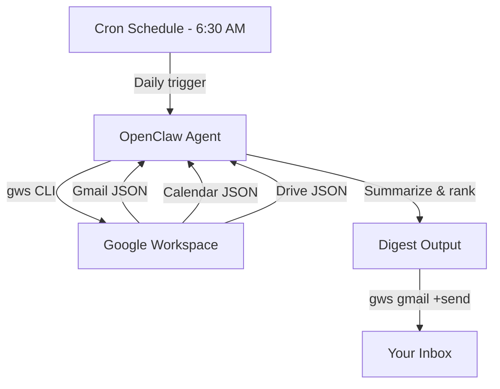

## What This System Solves

Every morning starts the same way: you open Gmail and there are 47 unread messages, half of which are threads you're CC'd on. Your calendar has 6 meetings but you haven't prepped for any of them. Somewhere in Drive, three people shared documents with you overnight that you haven't opened. You spend the first 30-45 minutes of your day just figuring out *what happened* before you can start doing anything about it.

This system creates an **automated daily digest agent** that scans your Gmail, Calendar, and Drive before you wake up, then produces a single structured briefing: what's urgent in your inbox, what's on your calendar today with prep context, and what's new or changed in your shared files. One document. Everything you need. Ready when you are.

The key ingredient is **gws** — the Google Workspace CLI that gives your agent structured JSON access to every Workspace API. No brittle OAuth wrappers, no outdated SDKs, no custom integrations. One tool, every service, always current.

## Architecture



<StepCard number={1} label="Prerequisites" heading="Install and authenticate gws">

You need the `gws` CLI installed and authenticated against your Google Workspace account. If you followed the setup from the gws repo, you're already there. If not, it's three commands:

```bash
# Install the CLI
npm install -g @googleworkspace/cli

# Set up auth (walks you through GCP project + OAuth)
gws auth setup

# Login to your account
gws auth login
```

Test it by running `gws gmail +triage --max 3` — if you see your recent emails in JSON, you're good. Then symlink the skills your agent will need into your OpenClaw skills directory:

```bash
# Clone the repo and link the relevant skills
git clone https://github.com/googleworkspace/cli.git
ln -s $(pwd)/cli/skills/gws-gmail ~/.openclaw/skills/
ln -s $(pwd)/cli/skills/gws-calendar ~/.openclaw/skills/
ln -s $(pwd)/cli/skills/gws-drive ~/.openclaw/skills/
ln -s $(pwd)/cli/skills/gws-shared ~/.openclaw/skills/
```

The `gws-shared` skill is important — it includes an install block that lets your agent auto-bootstrap the CLI if it's ever missing from the PATH.

</StepCard>

<StepCard number={2} label="The workflow" heading="Write the digest prompt">

Create a `digest.md` prompt file that instructs your agent to perform three data pulls and one synthesis step. The structure matters here — you want the agent to gather everything *before* it starts summarizing, so it can cross-reference context between services.

**Step 1 — Inbox scan.** Instruct the agent to fetch unread emails from the last 12 hours using `gws gmail +triage`. Tell it to classify each message into one of four buckets: *requires action*, *requires reply*, *FYI only*, and *ignorable*. Be specific about your classification rules — for example, emails where you're in the To field get ranked higher than CC'd threads, emails from your manager or direct reports always count as "requires action," and newsletter-pattern senders always go to "ignorable."

**Step 2 — Calendar preview.** Have the agent pull today's events using `gws calendar +agenda`. For each meeting, instruct it to note the organizer, attendee count, whether there's an attached document or agenda, and the time until the meeting starts. If a meeting has a linked Google Doc, the agent should fetch the doc title from Drive so the digest can remind you to review it.

**Step 3 — Drive activity.** Query recent Drive activity for files shared with you or modified in the last 24 hours using `gws drive files list` with an appropriate query filter. Focus on documents where you've been added as a commenter or editor — these usually require attention.

**Step 4 — Synthesize.** The agent combines all three data pulls into a single digest with three sections: an *Action Required* block (ranked by urgency), a *Today's Schedule* block (with prep notes), and a *New in Drive* block. The key instruction: keep the entire digest under 500 words. Brevity is the whole point. If the agent produces a wall of text, it's defeated the purpose.

```bash
# Example gws commands the agent will run internally:

# Inbox triage
gws gmail +triage --max 20 --query 'is:unread newer_than:12h'

# Today's agenda
gws calendar +agenda

# Recent Drive activity
gws drive files list --params '{
  "q": "modifiedTime > '\''2026-03-05T00:00:00'\'' and not '\''me'\'' in owners",
  "pageSize": 15,
  "fields": "files(name,modifiedTime,owners,webViewLink)"
}'

# Deliver the digest as a self-email
gws gmail +send --to me@company.com \
  --subject 'Daily Digest — March 6' \
  --body "$DIGEST_CONTENT"
```

</StepCard>

<StepCard number={3} label="Schedule & refine" heading="Deploy and tune the output">

Set up a cron job to run the digest 30 minutes before your usual start time. Something like `30 6 * * 1-5` for a 6:30 AM weekday trigger. The digest lands in your inbox before you open your laptop.

For the first week, run it manually each morning and review the output. The two things that need the most tuning are **classification accuracy** (is the agent putting the right emails in the right buckets?) and **summary length** (is it concise enough to scan in 60 seconds?). Adjust your prompt based on what you see. After a week of tuning, it should run silently and save you half an hour every morning.

Pro tip: use `gws gmail +send` rather than a third-party email tool to deliver the digest. Since you're already authenticated through gws, it's zero additional setup and the email appears as a normal message in your inbox — no app notifications, no separate dashboard to check.

</StepCard>

## Advanced Patterns

Once the basic digest is reliable, layer in context that makes it smarter. Add **thread summarization** for long email chains — instead of listing "Re: Re: Re: Q2 Budget," the agent reads the thread and gives you a one-sentence summary of where the discussion stands. Pull in **Sheets data** for teams that track KPIs in spreadsheets — your digest can include a line like "pipeline is at $420K, up 12% from yesterday" without you opening the sheet. You can also add a **prep block** for your first meeting of the day: the agent checks the meeting's shared Drive folder, summarizes the latest document edits, and tells you what changed since you last looked.

## Limitations

The digest is only as smart as your classification prompt. If your inbox doesn't follow predictable patterns — if critical messages sometimes come from random external addresses — the agent will misrank them. Drive activity queries surface *recently modified* files, not *files that need your attention*, so expect some noise from documents that were shared with you weeks ago and just got a minor edit. The agent also can't read the *content* of attachments or images in emails, so a message that says "see attached" with a critical PDF will get classified based on subject and sender alone.

## Expansion Paths

The digest agent is the natural foundation for a full **workspace awareness layer**. Extend it with a **weekly rollup** every Friday that summarizes inbox volume trends, meeting load, and which collaborators you interacted with most — useful for managers who need to track where their time goes. Add **Google Chat delivery** for teams that live in Chat instead of email, using `gws chat +send` to drop the digest into a dedicated space. For multi-account setups (work + personal), gws supports multiple authenticated accounts, so you can build a unified digest that covers both inboxes in a single briefing.

## Cross-System Hooks

This system pairs naturally with a [Morning Standup Brief](/blueprints/morning-standup-brief) — the digest handles personal awareness while the standup covers team context. It feeds well into an [Autonomous Secretary](/blueprints/autonomous-secretary) that can act on the digest's findings: auto-declining meetings with no agenda, replying to FYI-only threads with an acknowledgment, or creating tasks from action-required emails. For teams using the gws **Executive Assistant persona skill**, the digest prompt can be absorbed directly into that persona's daily routine.
