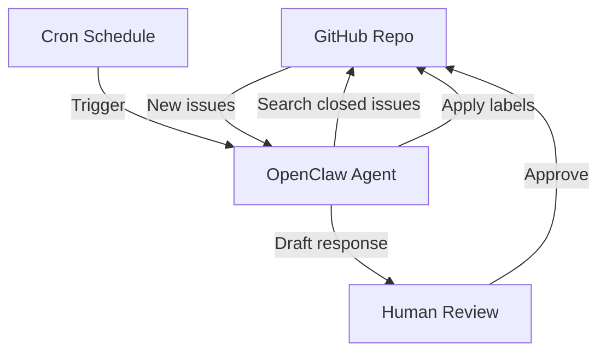

## What This System Solves

Open-source maintainers and dev teams drown in issues. New ones pile up, duplicates go unnoticed, labels are inconsistent, and first responses take days — if they happen at all. Most people either ignore the backlog or burn time manually sorting through it.

This system creates an **automated triage operator** that reads new issues, checks for duplicates, applies labels, and drafts first responses — all without touching your codebase or merging anything. It's a read-and-respond layer that keeps your issue tracker clean while you focus on shipping.

## Architecture

<StepCard number={1} label="Prerequisites" heading="Set up GitHub MCP server">

You need the GitHub MCP server connected with a personal access token that has `repo` scope. Add it to your Claude Code config:

Install the official [GitHub MCP Server](https://github.com/github/github-mcp-server) and set your `GITHUB_TOKEN` environment variable. Test it by asking Claude to "list open issues on my repo" — if it returns results, you're good.

</StepCard>

<StepCard number={2} label="The prompt" heading="Write the triage instruction file">

Create a `triage.md` prompt file that instructs the agent to: (1) fetch all issues opened in the last 24 hours on your target repo, (2) for each new issue, search closed issues for similar titles or keywords to check for duplicates, (3) apply labels based on the issue content (bug, feature, question, etc.), (4) draft a first response acknowledging the issue and asking for any missing information.

The key is being specific about your labeling taxonomy. List your exact labels and what criteria should trigger each one. The more specific your instructions, the better the triage quality.

</StepCard>

<StepCard number={3} label="Safety rails" heading="Set up review before posting">

**Important**: Don't let the agent post responses automatically at first. Instead, have it output the drafted responses to a file or send them to you for review.

Once you've reviewed 20-30 triaged issues and the quality is consistently good, you can switch to auto-posting. But start with a human review step. An incorrect auto-response on a public repo is worse than no response.

</StepCard>

<StepCard number={4} label="Schedule & monitor" heading="Run it on a schedule">

Set up a cron job to run the triage script every few hours during business hours. Something like `0 9,12,15,18 * * 1-5` covers the workday nicely.

Monitor the results for the first week. Check that labels are accurate, duplicate detection is working, and drafted responses are helpful. Tweak the prompt based on what you see. After a week of tuning, this should be running silently and saving you an hour a day.

</StepCard>

## Advanced Patterns

Once the basic triage loop is solid, you can push it further. Add **sentiment detection** so the agent flags frustrated users for priority response — tone matters as much as labels. You can also build a **stale issue sweeper** that pings authors on issues with no activity for 14+ days, asking if the problem is still relevant. For larger repos, consider splitting the triage prompt by label category — one prompt tuned for bugs (asking for reproduction steps), another for feature requests (asking for use cases). The more specialized the prompt, the sharper the output.

## Limitations

Label accuracy depends heavily on how specific your triage prompt is. Vague taxonomies lead to vague labels — if "bug" and "unexpected behavior" overlap in your project, the agent will struggle too. Duplicate detection works on title and keyword similarity, not semantic understanding, so differently-worded reports of the same bug can slip through. And auto-posting responses on a public repo carries real risk — one bad auto-reply can damage trust with contributors. Always start with human review.

## Expansion Paths

The triage agent is a natural entry point for a broader **issue lifecycle system**. Next steps include routing triaged issues to the right team members based on label and codebase ownership, auto-linking related PRs when they're opened, and generating weekly triage reports with trends — which labels are spiking, which areas of the codebase are generating the most issues. You could also connect it to **Linear or Jira** to auto-create tasks from confirmed bugs.

## Cross-System Hooks

This system pairs well with a [Morning Standup Brief](/systems/morning-standup-brief) — triaged issues feed into the daily summary so you know what came in overnight. It can also hand off to a [Failed Payment Recovery](/systems/failed-payment-recovery) system if your repo tracks billing-related issues, and connects naturally to a **Document Scribe** for auto-updating internal runbooks when recurring issues point to documentation gaps.
