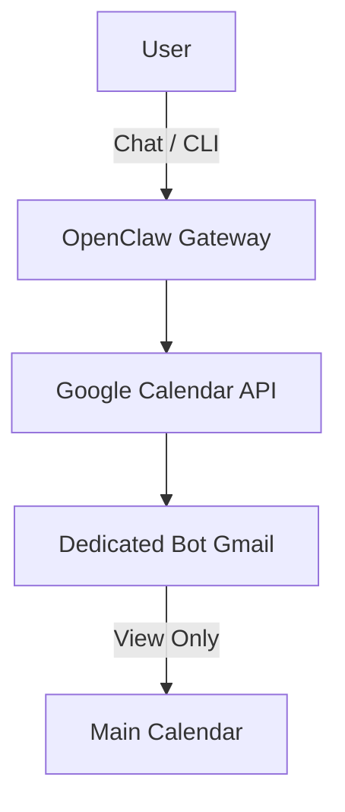

## What This System Solves

Most people either don't automate scheduling, or give an agent too much access. This system creates a **controlled scheduling operator** using a scoped identity and minimal permissions.

The power: proactive scheduling without exposing your primary email or inbox.

## Architecture

<StepCard number={1} label="Identity" heading="Create a dedicated bot identity">

Create a separate Gmail account (e.g. `assistant-bot@gmail.com`). **Never use your primary account.** This scoped identity is the firewall — it limits what the agent can see and do, and keeps your personal inbox untouched.

</StepCard>

<StepCard number={2} label="Permissions" heading="Share your calendar (view only)">

Go to **Google Calendar > Settings > Share with specific people**. Add your bot Gmail with **"See all event details"** permission.

Avoid giving edit permissions initially. You can escalate later once you trust the system's behavior over a few weeks of use.

</StepCard>

<StepCard number={3} label="API Setup" heading="Enable the Google Calendar API">

In Google Cloud Console:
1. Create a new project
2. Enable **Google Calendar API**
3. Configure OAuth consent screen (External)
4. Create a **Desktop** credential
5. Download `credentials.json`

Keep this credential scoped to Calendar only — no Gmail, no Drive.

</StepCard>

<StepCard number={4} label="Connect" heading="Link to OpenClaw">

In your OpenClaw chat, say:

*"Set up Google Calendar access using this OAuth JSON."*

Paste the credential. OpenClaw will walk you through the OAuth flow and store the token. Test it by asking: *"What's on my calendar tomorrow?"*

</StepCard>

<StepCard number={5} label="Execute" heading="Run it — example commands">

Once connected, here's what you can do:

1. **Find an open slot** — *"Find a 30-minute slot tomorrow after 2PM."*
2. **Draft without sending** — *"Draft an invite for Friday 14:00 titled Planning Session."*
3. **Add buffer rules** — *"Always keep 15 minutes between meetings."*

Start with read-only queries to build trust, then escalate to drafting invites once you're confident in the output.

</StepCard>

## Advanced Patterns

Once the base system is running, you can layer in slot scoring logic to make scheduling smarter. The idea is to move from reactive ("find me a slot") to proactive — the agent learns your preferences and optimizes around them. Think morning slots for external calls, protected afternoons for deep work, and automatic buffer zones so you never end up in back-to-back meetings again. You can also weight by day density, spreading meetings across the week instead of clustering them.

## Limitations

This system works well within its scope, but it's worth knowing the edges. OAuth tokens expire and need periodic refresh — if the agent goes quiet, that's usually why. Google's API quotas can throttle high-frequency polling, so this isn't built for real-time event watching. Write access (actually creating events) requires you to explicitly escalate permissions beyond the initial view-only setup. And if you run multiple calendars across different accounts, conflict resolution across them isn't natively supported yet.

## Expansion Paths

The scheduling firewall is a strong foundation to build on. Natural next steps include plugging in a **travel API** to auto-block calendar around flights and hotel check-ins, or routing daily schedule summaries to **Slack** so your team knows your availability without asking. You could also add **auto-reschedule detection** — when a new conflict appears, the agent proposes alternatives — and **timezone intelligence** for teams spread across regions.

## Cross-System Hooks

This system doesn't live in isolation. It feeds naturally into the [Morning Standup Brief](/systems/morning-standup-brief) for schedule overviews, can hand off meeting context to a **Document Scribe** for automatic note-taking, and pairs well with a **Voice Summary** agent if you prefer audio updates over reading.
