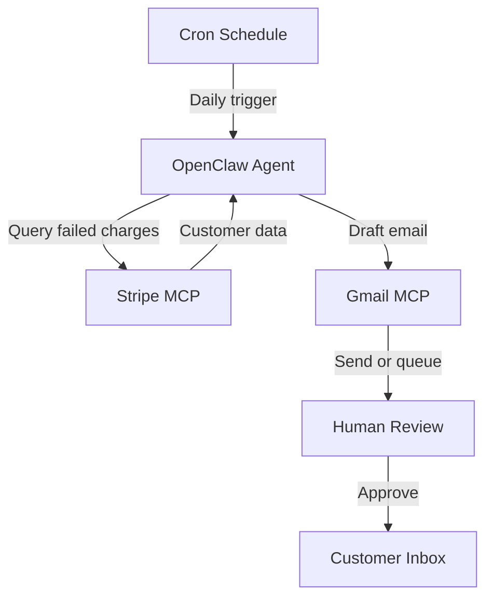

## What This System Solves

Failed payments are silent revenue killers. Most SaaS companies lose 5–10% of MRR to involuntary churn — expired cards, insufficient funds, bank declines. The default Stripe dunning emails are generic and easy to ignore. Most teams either don't follow up at all, or waste hours manually checking the dashboard and writing one-off emails.

This system creates a **payment recovery pipeline** that detects failed charges, pulls customer context from Stripe, and drafts personalized recovery emails through Gmail. The key difference: every email is tailored to the specific customer, their plan, and their payment history — not a template blast.

## Architecture

<StepCard number={1} label="Prerequisites" heading="Connect Stripe and Gmail MCP servers">

You need two MCP servers: **Stripe MCP** for monitoring payments and **Gmail MCP** for sending recovery emails.

For Stripe, get your API key from the Stripe Dashboard → Developers → API keys. Use your restricted key with read access to charges, customers, and subscriptions. For Gmail, you'll need OAuth credentials — follow the Gmail MCP setup guide to generate your token.

Add both to your Claude Code config and test each independently. Try "list recent failed payments" for Stripe and "list my recent emails" for Gmail to verify both are working.

</StepCard>

<StepCard number={2} label="The workflow" heading="Build the detection and drafting pipeline">

Create a prompt file that instructs the agent to: (1) query Stripe for all failed charges in the last 24 hours, (2) for each failed charge, look up the customer's name, email, subscription plan, and payment history, (3) draft a personalized recovery email that's empathetic, mentions their specific plan, and includes a link to update their payment method.

The personalization is what makes this powerful. A generic "your payment failed" email gets ignored. An email that says "Hey Marcus, your Pro plan payment of $49 didn't go through — looks like your Visa ending in 4242 expired" gets action.

Include a template in your prompt with variables the agent should fill in. Set the tone: helpful, not threatening. You want to recover the payment, not scare the customer away.

</StepCard>

<StepCard number={3} label="Deploy & iterate" heading="Schedule and track recovery rates">

Run this daily via cron, ideally in the morning so customers see the email during business hours. Start by having the agent draft emails for your review rather than sending automatically.

After a week of consistent quality, enable auto-send. Track your recovery rate — most SaaS companies see 20-40% of failed payments recovered with timely, personalized outreach. Compare this to your current recovery rate to measure the impact.

Pro tip: add a follow-up step. If the customer hasn't updated their payment method within 3 days, send a shorter, more urgent follow-up. Two touches typically recover more than one.

</StepCard>

## Advanced Patterns

Once the base recovery loop is working, you can layer in intelligence. Add **churn risk scoring** based on payment history — a customer who's failed once in two years gets a gentle nudge, while someone on their third consecutive failure gets a more urgent tone with an offer to hop on a call. You can also build **retry timing logic** that coordinates with Stripe's automatic retry schedule, so your outreach lands between retries rather than competing with them. For higher-value accounts, route the draft to your success team instead of auto-sending — a personal touch from a human on a $500/mo plan is worth the extra step.

## Limitations

This system is powerful but sensitive. Email tone is everything — too casual and it feels careless, too aggressive and you lose the customer entirely. Expect to spend the first week tuning your prompt templates before the output is consistently right. The system also can't distinguish between a genuinely expired card and a customer who's intentionally letting their subscription lapse — so you may occasionally send recovery emails to people who've already decided to leave. Stripe's API rate limits apply, and if you're processing hundreds of failed payments daily, you'll need to batch your queries.

## Expansion Paths

The recovery pipeline is a natural starting point for a broader **revenue operations system**. You can extend it with **payment method expiration alerts** — emailing customers before their card expires, not after it fails. Add **win-back campaigns** for customers who do churn, triggered 30 or 60 days after cancellation. Connect it to your **billing dashboard** to auto-generate weekly recovery reports with rates, revenue saved, and trends. For teams using Slack, route daily recovery summaries to a channel so leadership has visibility without checking Stripe.

## Cross-System Hooks

This system connects well to the [Morning Standup Brief](/systems/morning-standup-brief) — failed payment counts and recovery rates make a useful daily metric. It can also feed into an [Automated Issue Triage](/systems/automated-issue-triage) system if customers open support tickets about billing, helping the triage agent flag payment-related issues for priority handling. For teams running multiple agent systems, the recovery pipeline's customer context can be shared with a **Document Scribe** to keep internal CRM notes up to date.
