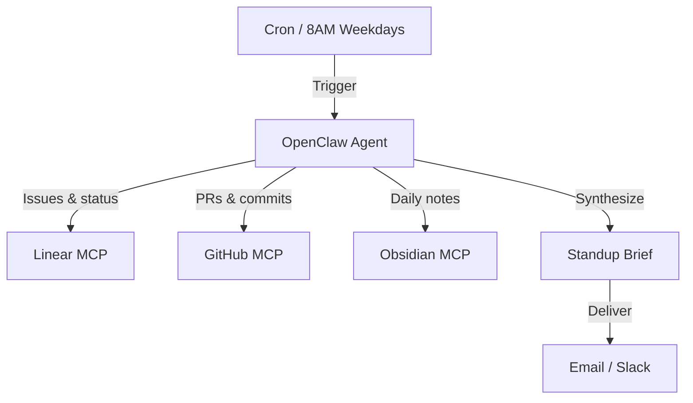

## What This System Solves

Every morning starts the same way — you open Linear, check GitHub, skim Slack, glance at your notes, and try to piece together where things stand. By the time you have a clear picture, 20 minutes are gone and your focus is already fragmented.

This system builds a **daily aggregation agent** that pulls from your project management, code, and knowledge tools overnight, then delivers a single synthesized brief to your inbox before you sit down. Blockers, open PRs, yesterday's progress, today's priorities — all in one read, under two minutes.

## Architecture

<StepCard number={1} label="Prerequisites" heading="Install and configure your MCP servers">

You need three MCP servers running: **Linear**, **GitHub**, and **Obsidian**. Each needs an API key. Add them to your Claude Code config file.

Get your Linear API key from Linear → Settings → API → Personal API keys. Get a GitHub personal access token from GitHub → Settings → Developer settings → Personal access tokens. For Obsidian, you just need the path to your local vault.

Test each server independently first with `claude --mcp-debug` to confirm all tools are available before continuing.

</StepCard>

<StepCard number={2} label="The prompt" heading="Write your standup prompt file">

Save this as `standup.md` in your project. This is the instruction set your agent runs every morning. Customize the team name and vault path for your setup.

The prompt should instruct the agent to: (1) fetch all Linear issues updated in the last 24 hours, (2) list open PRs and their review status, (3) read your Obsidian daily note, (4) synthesize everything into sections: Blockers, In Progress, Needs Review, Today's Focus.

Add a line at the end: "If you cannot find data from any source, say so explicitly — never hallucinate." This keeps the output honest.

</StepCard>

<StepCard number={3} label="The runner script" heading="Create the shell script that runs it">

Create a shell script that kicks off the agent session, captures the output, and pipes it to your email. You can use `msmtp`, `sendmail`, the Mailgun API, or even a Slack webhook. The output is just plain text — pipe it wherever you want.

The script should run Claude with your MCP config, the prompt file, and `--no-interactive` mode. Capture the output to a variable, then format it as an email with a subject line like "Standup 2025-02-22" and send it.

</StepCard>

<StepCard number={4} label="Schedule it" heading="Set up your cron job">

Run `crontab -e` and add a line to trigger the script at 8am every weekday: `0 8 * * 1-5 /bin/bash ~/agents/standup.sh`

Make sure the script is executable first with `chmod +x ~/agents/standup.sh`.

On Mac, use launchd instead of cron for more reliable scheduling. Or run it via a GitHub Action if you want it cloud-hosted.

</StepCard>

<StepCard number={5} label="Refine & extend" heading="Tune the prompt until it's yours">

Run the script manually first and see what you get. The output will likely be slightly too verbose or miss context you care about. Edit the prompt until it's perfect — this is where the real value is.

Common extensions: add **Stripe MCP** to include yesterday's revenue and failed payments. Add **Slack MCP** to surface urgent mentions you missed. Create a "FLAG:" system in Obsidian where anything tagged gets surfaced first in the brief.

The goal is a single email you can read in under 2 minutes that tells you exactly where things stand. No dashboards. No context switching.

</StepCard>

## What Makes This Work

The value isn't in any single data source — it's in the synthesis. Linear alone tells you about tickets. GitHub alone tells you about code. Obsidian alone tells you what you were thinking yesterday. But none of them answer the question you actually care about at 8AM: *where do things stand, and what should I focus on today?*

The agent bridges those silos. It reads across tools the way you would, but does it in seconds instead of 20 minutes. The prompt is where all the intelligence lives — spend time tuning it. A well-tuned prompt produces a brief that feels like it was written by someone who deeply understands your workflow. A lazy prompt produces a data dump.

## Pros and Cons

On the upside, this is one of the highest-ROI systems you can build. It runs silently, costs almost nothing, and saves real time every single day. It also scales naturally — adding a new data source (Stripe for revenue, Slack for mentions) is just another paragraph in the prompt. And because the output is plain text, you can pipe it anywhere: email, Slack, Notion, a text file on your desktop.

The downsides are real too. The brief is only as good as the data in your tools — if your team doesn't update Linear or write meaningful PR descriptions, the agent will reflect that noise back at you. Multi-source aggregation means more MCP servers to maintain, and if one goes down (expired token, API change), the brief arrives incomplete. You'll also want to check the output for the first week or two — the agent can occasionally misread priority levels or conflate similar issues across tools.

## Where to Take It Next

The standup brief is a natural hub for other systems. Wire in an [Automated Issue Triage](/systems/automated-issue-triage) to include overnight triage results in the brief. Connect a [Failed Payment Recovery](/systems/failed-payment-recovery) system and surface yesterday's recovery stats alongside your engineering updates. For teams, you can run one brief per person with customized prompts, or a single team-wide brief that aggregates across everyone's Linear assignments.

Beyond that, consider adding a **weekly digest** variant that summarizes the full week every Friday — patterns emerge at the weekly level that daily briefs miss. Or build a **meeting prep** variant that runs 15 minutes before your first meeting and pulls relevant context from the attendees' recent work.
